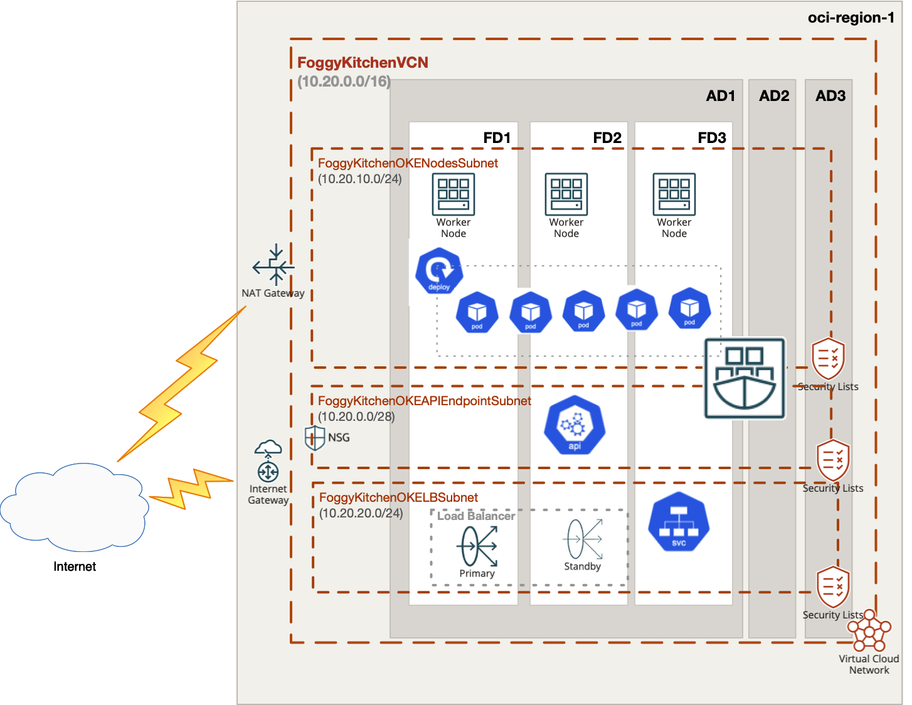

# OCI Container Engine for Kubernetes (aka OCI OKE) with OCI Load Balancer

## Project description

In this repository, I have documented my hands on experience with Terrafrom for the purpose of Container Engine for Kubernetes (aka OCI OKE) deployment with OCI Load Balancer. This set of HCL based Terraform files which can customized according to any requirements.  

## Topology Diagram 

With the usage of this example HCL code you can build topology documented by diagram below. This topology is extremly simplified for education purposes and rather cannot be used for production implementations. 



## How to use code 

### Deploy Using Oracle Resource Manager

1. Click [](https://cloud.oracle.com/resourcemanager/stacks/create?region=home&zipUrl=https://github.com/mlinxfeld/terraform-oci-oke-lb/releases/latest/download/terraform-oci-oke-lb-stack-latest.zip)

    If you aren't already signed in, when prompted, enter the tenancy and user credentials.

2. Review and accept the terms and conditions.

3. Select the region where you want to deploy the stack.

4. Follow the on-screen prompts and instructions to create the stack.

5. After creating the stack, click **Terraform Actions**, and select **Plan**.

6. Wait for the job to be completed, and review the plan.

    To make any changes, return to the Stack Details page, click **Edit Stack**, and make the required changes. Then, run the **Plan** action again.

7. If no further changes are necessary, return to the Stack Details page, click **Terraform Actions**, and select **Apply**. 

### Deploy Using the Terraform CLI

#### STEP 1.

Clone the repo from GitHub.com by executing the command as follows and then go to terraform-oci-private-oke directory:

```
[opc@terraform-server ~]$ git clone https://github.com/mlinxfeld/terraform-oci-oke-lb
Cloning into 'terraform-oci-oke-lb'...
remote: Enumerating objects: 29, done.
remote: Counting objects: 100% (29/29), done.
remote: Compressing objects: 100% (20/20), done.
remote: Total 29 (delta 9), reused 28 (delta 8), pack-reused 0
Receiving objects: 100% (29/29), 308.42 KiB | 2.27 MiB/s, done.
Resolving deltas: 100% (9/9), done.

[opc@terraform-server ~]$ cd terraform-oci-oke-lb/

[opc@terraform-server terraform-oci-oke-lb]$ ls -latr

drwxr-xr-x  84 opc opc    2688 Aug 25 14:35 ..
-rw-r--r--   1 opc opc     292 Aug 25 14:37 compartment.tf
-rw-r--r--   1 opc opc    1314 Aug 25 14:37 locals.tf
-rw-r--r--@  1 opc opc  323681 Aug 25 14:37 terraform-oci-oke-lb.png
-rw-r--r--   1 opc opc      80 Aug 25 14:37 tls.tf
drwxr-xr-x   4 opc opc     128 Aug 25 14:38 templates
drwxr-xr-x   9 opc opc     288 Aug 25 14:49 .git
-rw-r--r--   1 opc opc     743 Aug 25 14:52 provider.tf
-rw-r--r--   1 opc opc    5027 Aug 25 15:07 schema.yaml
-rw-r--r--   1 opc opc    1968 Aug 25 16:36 oke.tf
-rw-r--r--   1 opc opc    1233 Aug 25 16:52 deploy_ngnix_and_service.tf
-rw-r--r--   1 opc opc     350 Aug 26 08:51 outputs.tf
-rw-r--r--   1 opc opc   13748 Aug 26 08:56 network.tf
drwxr-xr-x  24 opc opc     768 Aug 26 11:45 .
-rw-r--r--   1 opc opc    2212 Aug 26 11:49 variables.tf
-rw-r--r--   1 opc opc    1366 Aug 26 11:49 datasources.tf
-rw-r--r--   1 opc opc   18299 Aug 26 11:51 README.md
```

#### STEP 2.

Within web browser go to URL: https://www.terraform.io/downloads.html. Find your platform and download the latest version of your terraform runtime. Add directory of terraform binary into PATH and check terraform version:

```
[opc@terraform-server terraform-oci-oke-lb]$ export PATH=$PATH:/home/opc/terraform

[opc@terraform-server terraform-oci-oke-lb]$ terraform --version

Terraform v1.0.0

Your version of Terraform is out of date! The latest version
is 1.2.2. You can update by downloading from https://www.terraform.io/downloads.html
```

#### STEP 3. 
Next create environment file with TF_VARs:

```
[opc@terraform-server terraform-oci-oke-lb]$ vi setup_oci_tf_vars.sh
export TF_VAR_user_ocid="ocid1.user.oc1..aaaaaaaaob4qbf2(...)uunizjie4his4vgh3jx5jxa"
export TF_VAR_tenancy_ocid="ocid1.tenancy.oc1..aaaaaaaas(...)krj2s3gdbz7d2heqzzxn7pe64ksbia"
export TF_VAR_compartment_ocid="ocid1.tenancy.oc1..aaaaaaaasbktyckn(...)ldkrj2s3gdbz7d2heqzzxn7pe64ksbia"
export TF_VAR_fingerprint="00:f9:d1:41:bb:57(...)82:47:e6:00"
export TF_VAR_private_key_path="/tmp/oci_api_key.pem"
export TF_VAR_region="eu-frankfurt-1"

[opc@terraform-server terraform-oci-oke-lb]$ source setup_oci_tf_vars.sh
```

#### STEP 4.
Run *terraform init* with upgrade option just to download the lastest neccesary providers:

```
[opc@terraform-server terraform-oci-oke-lb]$ terraform init 

Initializing the backend...

Initializing provider plugins...
- Finding latest version of hashicorp/null...
- Finding latest version of hashicorp/template...
- Finding latest version of oracle/oci...
- Finding latest version of hashicorp/random...
- Finding latest version of hashicorp/tls...
- Finding latest version of hashicorp/local...
- Installing hashicorp/template v2.2.0...
- Installed hashicorp/template v2.2.0 (signed by HashiCorp)
- Installing oracle/oci v4.84.0...
- Installed oracle/oci v4.84.0 (signed by a HashiCorp partner, key ID 1533A49284137CEB)
- Installing hashicorp/random v3.3.1...
- Installed hashicorp/random v3.3.1 (signed by HashiCorp)
- Installing hashicorp/tls v3.4.0...
- Installed hashicorp/tls v3.4.0 (signed by HashiCorp)
- Installing hashicorp/local v2.2.3...
- Installed hashicorp/local v2.2.3 (signed by HashiCorp)
- Installing hashicorp/null v3.1.1...
- Installed hashicorp/null v3.1.1 (signed by HashiCorp)

Partner and community providers are signed by their developers.
If you'd like to know more about provider signing, you can read about it here:
https://www.terraform.io/docs/cli/plugins/signing.html

Terraform has created a lock file .terraform.lock.hcl to record the provider
selections it made above. Include this file in your version control repository
so that Terraform can guarantee to make the same selections by default when
you run "terraform init" in the future.

Terraform has been successfully initialized!

You may now begin working with Terraform. Try running "terraform plan" to see
any changes that are required for your infrastructure. All Terraform commands
should now work.

If you ever set or change modules or backend configuration for Terraform,
rerun this command to reinitialize your working directory. If you forget, other
commands will detect it and remind you to do so if necessary.
```

#### STEP 5.
Run *terraform apply* to provision the content of this repo (type **yes** to confirm the the apply phase):

```
[opc@terraform-server terraform-oci-oke-lb]$ terraform apply

data.template_file.service_deployment: Reading...
data.template_file.ngnix_deployment: Reading...
data.template_file.ngnix_deployment: Read complete after 0s [id=f0a8ce1368a283350f8ff47169cc7b67b7a3982f346ef8b7b08dba250f931a41]
data.template_file.service_deployment: Read complete after 0s [id=f5b35edf1e645d62b7b175ae4aa12e84bdc79ac61a25fe6c0c625f6125e8bbeb]
data.oci_identity_region_subscriptions.home_region_subscriptions: Reading...
data.oci_identity_availability_domains.ADs: Reading...
data.oci_containerengine_node_pool_option.FoggyKitchenOKEClusterNodePoolOption: Reading...
data.oci_containerengine_cluster_option.FoggyKitchenOKEClusterOption: Reading...
data.oci_core_services.FoggyKitchenAllOCIServices: Reading...
data.oci_identity_availability_domains.ADs: Read complete after 0s [id=IdentityAvailabilityDomainsDataSource-3269541301]
data.oci_containerengine_cluster_option.FoggyKitchenOKEClusterOption: Read complete after 0s [id=ContainerengineClusterOptionDataSource-1870923232]
data.oci_core_services.FoggyKitchenAllOCIServices: Read complete after 0s [id=CoreServicesDataSource-0]
data.oci_identity_region_subscriptions.home_region_subscriptions: Read complete after 1s [id=IdentityRegionSubscriptionsDataSource-3269541301]
data.oci_containerengine_node_pool_option.FoggyKitchenOKEClusterNodePoolOption: Read complete after 2s [id=ContainerengineNodePoolOptionDataSource-1870923232]

Terraform used the selected providers to generate the following execution plan. Resource actions are indicated with the following symbols:
  + create

Terraform will perform the following actions:

  # local_file.ngnix_deployment will be created
  + resource "local_file" "ngnix_deployment" {
      + content              = <<-EOT
            apiVersion: apps/v1
            kind: Deployment
            metadata:
              name: nginx-deployment

(...)

Terraform will perform the following actions:

(...)

Plan: 22 to add, 0 to change, 0 to destroy.

Changes to Outputs:
  + cluster_instruction = (known after apply)

Do you want to perform these actions?
  Terraform will perform the actions described above.
  Only 'yes' will be accepted to approve.

  Enter a value: yes

local_file.ngnix_deployment: Creating...
local_file.service_deployment: Creating...
tls_private_key.public_private_key_pair: Creating...
local_file.ngnix_deployment: Creation complete after 0s [id=219f897a9c01e21448850c71bfce9c803f404048]
local_file.service_deployment: Creation complete after 0s [id=5c6473a813f00ced989c585a8fd4a3263f679fec]
oci_identity_compartment.FoggyKitchenCompartment: Creating...
tls_private_key.public_private_key_pair: Creation complete after 0s [id=cc8d1a6bfea84c7234673625b177a5b8fb0c9df0]
oci_identity_compartment.FoggyKitchenCompartment: Provisioning with 'local-exec'...
oci_identity_compartment.FoggyKitchenCompartment (local-exec): Executing: ["/bin/sh" "-c" "sleep 60"]
oci_identity_compartment.FoggyKitchenCompartment: Still creating... [10s elapsed]
oci_identity_compartment.FoggyKitchenCompartment: Still creating... [20s elapsed]

(...)

null_resource.deploy_oke_ngnix (local-exec): Executing: ["/bin/sh" "-c" "sleep 60"]
null_resource.deploy_oke_ngnix: Still creating... [10s elapsed]
null_resource.deploy_oke_ngnix: Still creating... [20s elapsed]
null_resource.deploy_oke_ngnix: Still creating... [30s elapsed]
null_resource.deploy_oke_ngnix: Still creating... [40s elapsed]
null_resource.deploy_oke_ngnix: Still creating... [50s elapsed]
null_resource.deploy_oke_ngnix: Still creating... [1m0s elapsed]
null_resource.deploy_oke_ngnix: Provisioning with 'local-exec'...
null_resource.deploy_oke_ngnix (local-exec): Executing: ["/bin/sh" "-c" "kubectl get pods"]
null_resource.deploy_oke_ngnix (local-exec): NAME                                READY   STATUS              RESTARTS   AGE
null_resource.deploy_oke_ngnix (local-exec): nginx-deployment-85b9485b48-7vkbw   0/1     ContainerCreating   0          62s
null_resource.deploy_oke_ngnix (local-exec): nginx-deployment-85b9485b48-8bbb7   0/1     ContainerCreating   0          62s
null_resource.deploy_oke_ngnix (local-exec): nginx-deployment-85b9485b48-bb9qw   0/1     ContainerCreating   0          62s
null_resource.deploy_oke_ngnix (local-exec): nginx-deployment-85b9485b48-c7znx   0/1     ContainerCreating   0          62s
null_resource.deploy_oke_ngnix (local-exec): nginx-deployment-85b9485b48-c9tqr   0/1     ContainerCreating   0          62s
null_resource.deploy_oke_ngnix (local-exec): nginx-deployment-85b9485b48-kc9w8   0/1     ContainerCreating   0          62s
null_resource.deploy_oke_ngnix (local-exec): nginx-deployment-85b9485b48-kmvpv   1/1     Running             0          62s
null_resource.deploy_oke_ngnix (local-exec): nginx-deployment-85b9485b48-ll6cz   0/1     ContainerCreating   0          62s
null_resource.deploy_oke_ngnix (local-exec): nginx-deployment-85b9485b48-vck49   0/1     ContainerCreating   0          62s
null_resource.deploy_oke_ngnix (local-exec): nginx-deployment-85b9485b48-xq6d4   0/1     ContainerCreating   0          62s
null_resource.deploy_oke_ngnix: Provisioning with 'local-exec'...
null_resource.deploy_oke_ngnix (local-exec): Executing: ["/bin/sh" "-c" "kubectl get services"]
null_resource.deploy_oke_ngnix (local-exec): NAME         TYPE           CLUSTER-IP     EXTERNAL-IP   PORT(S)        AGE
null_resource.deploy_oke_ngnix (local-exec): kubernetes   ClusterIP      10.96.0.1      <none>        443/TCP        5m9s
null_resource.deploy_oke_ngnix (local-exec): lb-service   LoadBalancer   10.96.215.49   <pending>     80:30809/TCP   62s
null_resource.deploy_oke_ngnix: Creation complete after 1m9s [id=8543360553551934017]

Apply complete! Resources: 22 added, 0 changed, 0 destroyed.

Outputs:

cluster_instruction = <<EOT
1.  Open OCI Cloud Shell.

2.  Execute below command to setup OKE cluster access:

$ oci ce cluster create-kubeconfig --region eu-frankfurt-1 --cluster-id ocid1.cluster.oc1.eu-frankfurt-1.aaaaaaaanggrohu6zwracw7c5hz5ryiyqckanmrvmv5erqabac43rqf7aq7q

3.  Get PODs names:

$ kubectl get pods

4.  Get services

$ kubectl get services
```

#### STEP 6.
After testing the environment you can remove the OCI OKE infra. You should just run *terraform destroy* (type **yes** for confirmation of the destroy phase):

```
lfeldman@lfeldman-mac terraform-oci-oke-lb % terraform destroy -auto-approve
data.template_file.ngnix_deployment: Reading...
tls_private_key.public_private_key_pair: Refreshing state... [id=1a015e3f39eaf45f95ef1f3081784f9bb44bf5c7]
data.template_file.ngnix_deployment: Read complete after 0s [id=f0a8ce1368a283350f8ff47169cc7b67b7a3982f346ef8b7b08dba250f931a41]
local_file.ngnix_deployment: Refreshing state... [id=219f897a9c01e21448850c71bfce9c803f404048]
data.oci_identity_region_subscriptions.home_region_subscriptions: Reading...
data.oci_containerengine_node_pool_option.FoggyKitchenOKEClusterNodePoolOption: Reading...
data.oci_containerengine_cluster_option.FoggyKitchenOKEClusterOption: Reading...
data.oci_core_services.FoggyKitchenAllOCIServices: Reading...
data.oci_identity_availability_domains.ADs: Reading...
oci_core_public_ip.FoggyKitchenLBPublicIP: Refreshing state... [id=ocid1.publicip.oc1.eu-frankfurt-1.amaaaaaanlc5nbyaucn5a3tr2troaohtqemq7ufe4ggztvne7atjrehzs66q]
data.oci_identity_availability_domains.ADs: Read complete after 0s [id=IdentityAvailabilityDomainsDataSource-3269541301]
data.template_file.service_deployment: Reading...
data.template_file.service_deployment: Read complete after 0s [id=cdc20c92569989afbc92901f3bbe22893f71733a7ee0ccdb7a709c60961b1d2a]
data.oci_containerengine_cluster_option.FoggyKitchenOKEClusterOption: Read complete after 0s [id=ContainerengineClusterOptionDataSource-1870923232]
local_file.service_deployment: Refreshing state... [id=d95f1608c7d5ac837802281ea8b963dbac928fe8]
data.oci_core_services.FoggyKitchenAllOCIServices: Read complete after 0s [id=CoreServicesDataSource-0]
data.oci_identity_region_subscriptions.home_region_subscriptions: Read complete after 1s [id=IdentityRegionSubscriptionsDataSource-3269541301]
oci_identity_compartment.FoggyKitchenCompartment: Refreshing state... [id=ocid1.compartment.oc1..aaaaaaaayxvhhjidfxsq35muvshgxv62ac2mn6mi2yo2xqzsq53jgkuozfwq]
oci_core_virtual_network.FoggyKitchenVCN: Refreshing state... [id=ocid1.vcn.oc1.eu-frankfurt-1.amaaaaaanlc5nbyacxl4omndsdwzpjqvzfbmk6nl5oterpmvrwc3slrq56xq]
oci_core_network_security_group.FoggyKitchenNSG: Refreshing state... [id=ocid1.networksecuritygroup.oc1.eu-frankfurt-1.aaaaaaaa7zjrfcea2mcmwvcjzvr5lyurel74qvloj4jdqz2ewy7sjoul3s4q]
oci_core_internet_gateway.FoggyKitchenInternetGateway: Refreshing state... [id=ocid1.internetgateway.oc1.eu-frankfurt-1.aaaaaaaatalepj5cbuznbhfe7zw6k2pt5mhbowdgfp7unbnvvwvjoelns7fq]
oci_core_nat_gateway.FoggyKitchenNATGateway: Refreshing state... [id=ocid1.natgateway.oc1.eu-frankfurt-1.aaaaaaaahukzrzejzie364enn6vdmyad5xq52sbfb2kwya6utzhetguxljsq]
oci_core_service_gateway.FoggyKitchenServiceGateway: Refreshing state... [id=ocid1.servicegateway.oc1.eu-frankfurt-1.aaaaaaaay27u6jqpuxcxcv2psdun3jdp7bcw2ks5y644tfcgrhj5wzb4bxua]
oci_core_security_list.FoggyKitchenOKELBSecurityList: Refreshing state... [id=ocid1.securitylist.oc1.eu-frankfurt-1.aaaaaaaadqy2mqbomrlfaefrf27ioqbj27e5zg3fxnqpjaxcrvrbtsovrz4q]
oci_core_security_list.FoggyKitchenOKEAPIEndpointSecurityList: Refreshing state... [id=ocid1.securitylist.oc1.eu-frankfurt-1.aaaaaaaahv53cpounrlhdjtvtgnejat2kfevrer27ynrsrxqu5byrazyn7sq]
oci_core_security_list.FoggyKitchenOKENodesSecurityList: Refreshing state... [id=ocid1.securitylist.oc1.eu-frankfurt-1.aaaaaaaar3dd2c5midz26ptcs7xwmkfdemxdhemzaia73ud5x3qztzrwz5ia]
oci_core_network_security_group_security_rule.FoggyKitchenNSGRule6443: Refreshing state... [id=DA1BB9]
oci_core_network_security_group_security_rule.FoggyKitchenNSGRule12250: Refreshing state... [id=4F4991]
oci_core_route_table.FoggyKitchenVCNPrivateRouteTable: Refreshing state... [id=ocid1.routetable.oc1.eu-frankfurt-1.aaaaaaaamlo46dji53fmkkg5yidiyiy5gwyajydsuangzldqhhxjfwxpzbpq]
data.oci_containerengine_node_pool_option.FoggyKitchenOKEClusterNodePoolOption: Read complete after 2s [id=ContainerengineNodePoolOptionDataSource-1870923232]
oci_core_route_table.FoggyKitchenVCNPublicRouteTable: Refreshing state... [id=ocid1.routetable.oc1.eu-frankfurt-1.aaaaaaaaivzdqsivqysv2llgsqd44vgu6aiudcihvahmh5dfmctu2blaeuhq]
oci_core_subnet.FoggyKitchenOKENodesPodsSubnet: Refreshing state... [id=ocid1.subnet.oc1.eu-frankfurt-1.aaaaaaaa5b3cjhugmz26oyzanelfsuy22o37glee2hho7zbvjh2kluesbkgq]
oci_core_subnet.FoggyKitchenOKELBSubnet: Refreshing state... [id=ocid1.subnet.oc1.eu-frankfurt-1.aaaaaaaahplk2muvclpbsf2bczo2wjjlc3sla72zhjxxj4tmevifqvc7ar3a]
oci_core_subnet.FoggyKitchenOKEAPIEndpointSubnet: Refreshing state... [id=ocid1.subnet.oc1.eu-frankfurt-1.aaaaaaaaukkrvpe7jkesaz3sau3cdckug3yq7vrvo4lytfwsrqwruv54h6ma]
oci_containerengine_cluster.FoggyKitchenOKECluster: Refreshing state... [id=ocid1.cluster.oc1.eu-frankfurt-1.aaaaaaaa3k2vyzd7oeegdyr7dqok5gxjr3ucjax3lruunfadtcekftdb6lmq]
oci_containerengine_node_pool.FoggyKitchenOKENodePool: Refreshing state... [id=ocid1.nodepool.oc1.eu-frankfurt-1.aaaaaaaabk4yv3hwp3ftp737gz4mhynfinqdct2kmgqnnyuq4nwyeoz4anza]
null_resource.deploy_oke_ngnix: Refreshing state... [id=3621386567860012434]

Terraform used the selected providers to generate the following execution plan. Resource actions are indicated with the following symbols:
  - destroy

Terraform will perform the following actions:

  # local_file.ngnix_deployment will be destroyed
  - resource "local_file" "ngnix_deployment" {
      - content              = <<-EOT
            apiVersion: apps/v1
            kind: Deployment
            metadata:
              name: nginx-deployment
            spec:
              selector:
                matchLabels:
                  app: nginx
              replicas: 10
              template:
                metadata:
                  labels:
                    app: nginx
                spec:
                  containers:
                  - name: nginx
                    image: nginx:1.14.2
                    ports:
                    - containerPort: 80
                    resources:
                      requests:
                        memory: "500Mi"
        EOT -> null
      - directory_permission = "0777" -> null
      - file_permission      = "0777" -> null
      - filename             = "./ngnix.yaml" -> null
      - id                   = "219f897a9c01e21448850c71bfce9c803f404048" -> null
    }

(...)

oci_core_virtual_network.FoggyKitchenVCN: Destruction complete after 1s
oci_identity_compartment.FoggyKitchenCompartment: Destroying... [id=ocid1.compartment.oc1..aaaaaaaayxvhhjidfxsq35muvshgxv62ac2mn6mi2yo2xqzsq53jgkuozfwq]
oci_identity_compartment.FoggyKitchenCompartment: Destruction complete after 0s

Destroy complete! Resources: 23 destroyed.
```
